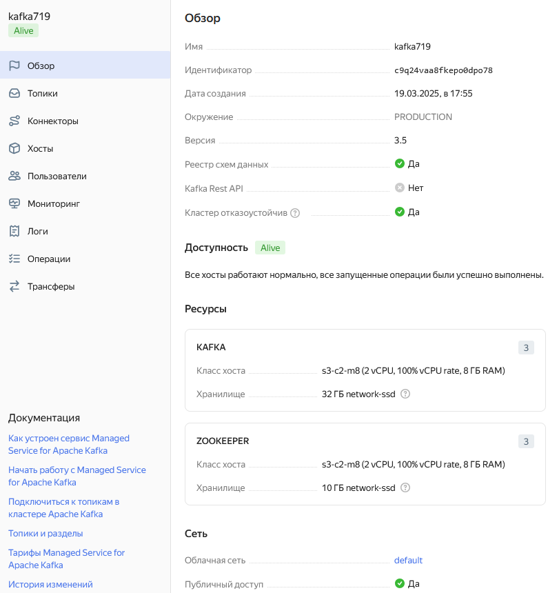
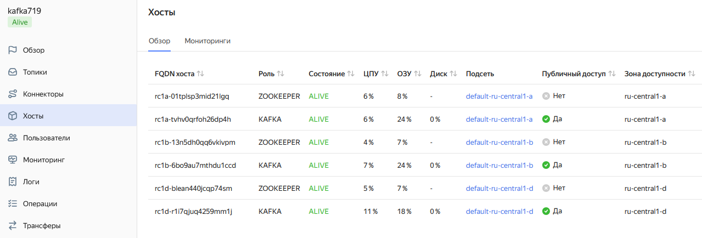
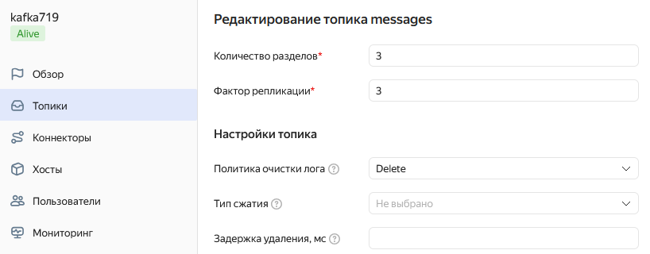
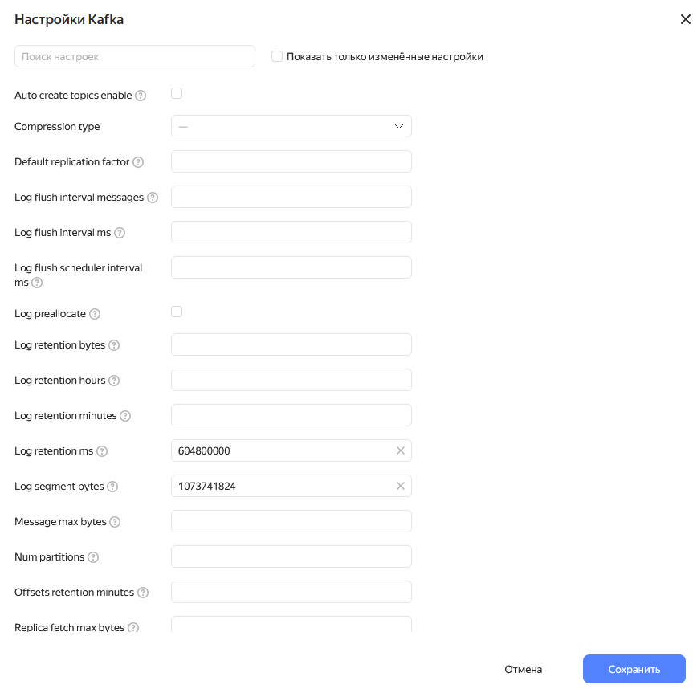
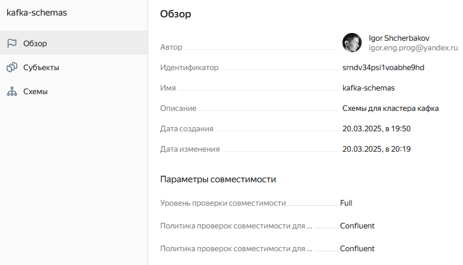
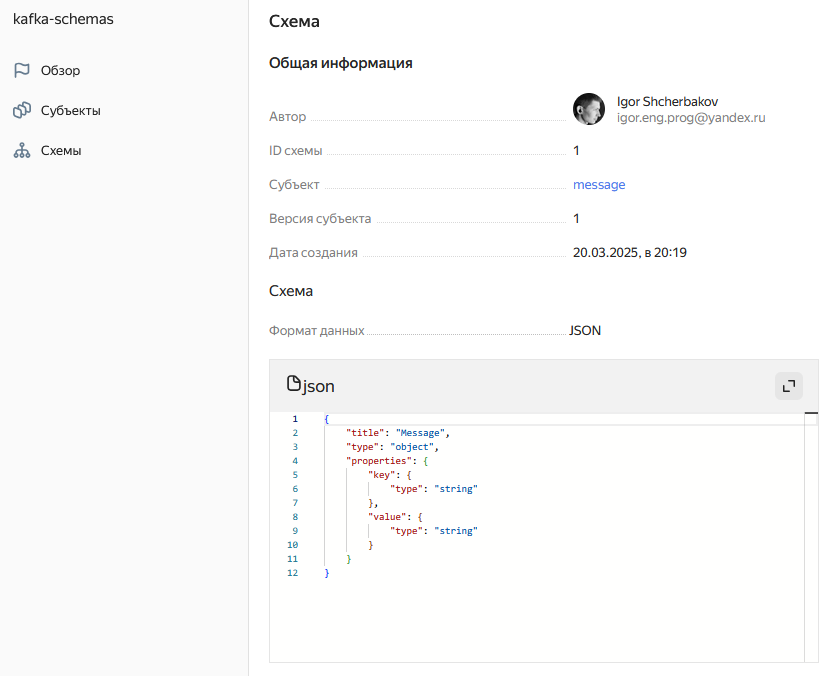
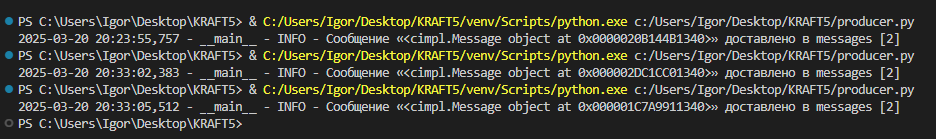
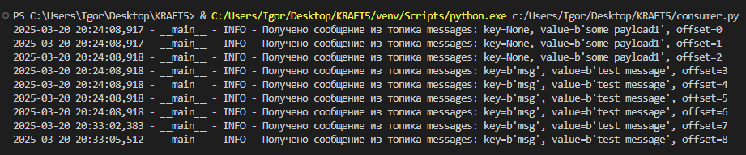

# KRAFT5
## Итоговый проект пятого модуля

## Подготовка 
1. Клонировать репозиторий
2. Создать виртуальное окружение
```bash
python -m venv venv
```
3. Активировать виртуальное окружение
```bash
venv\Scripts\Activate.ps1
```
4. Установить зависимости
```bash
pip install -r requirements.txt
```
5. Получить сертификат
```bash
mkdir -p ./secrets/ && \
curl -o ./secrets/YandexInternalRootCA.crt "https://storage.yandexcloud.net/cloud-certs/CA.pem" && \
chmod 0655 ./secrets/YandexInternalRootCA.crt
```
--5. Настройка Yandex Cloud CLI

## Задание 1.Развёртывание и настройка Kafka-кластера в Yandex Cloud

### Шаг 1. Разверните Kafka. Для этого:

Укажите оптимальные параметры аппаратных ресурсов для брокеров (количество дисков, CPU, RAM):



Разверните кластер Kafka в Yandex Cloud с 3 брокерами:



### Шаг 2. Настройте репликацию и хранение данных:

Создайте топик с 3 партициями и коэффициентом репликации 3:


Настройте политику очистки логов:



Установите параметры хранения (log.retention.ms, log.segment.bytes):



### Шаг 3. Настройте Schema Registry:

Разверните Schema Registry:



Зарегистрируйте схему данных:



### Шаг 4. Проверьте работу Kafka:

Напишите простой продюсер и консьюмер:

В корне имеются producer.py и consumer.py.

Отправьте тестовые сообщения и убедитесь, что они передаются через Kafka:

При запуске продюсера видим в терминале следующее:



При запуске консьюмера видим в терминале следующее:



## Задание 2. Интеграция Kafka с внешними системами (Apache NiFi / Hadoop)